# 🎨 Playful Minimalist SaaS Design System & Reference Guide
> **Target Audience:** Kids & Teenagers (High Engagement, Fun, Tactile) + Parents (High Trust, Clarity, Scannability)

This folder contains a complete reference library, real-world visual assets, interactive component demos, **recorded video clips capturing hover/scroll motion**, and an operational playbook on how to build a modern web application that balances **kids/teen coolness** with **parent-level trust and ease of use**.

---

## 📂 Reference Directory Structure

```text
d:/expg/unhearco/design-references/
├── assets/                                 # All captured UI screenshots & video recordings
│   ├── klarna_and_greenlight_motion_clip_1787135562631.webp  <-- Live Motion Recording Video
│   ├── scratch_and_greenlight_capture_1787134484761.webp     <-- Live Interaction Recording Video
│   ├── duolingo_homepage_1787134448519.png
│   ├── duolingo_characters_1787134382913.png
│   ├── scratch_main_page_1787134505223.png
│   ├── greenlight_hero_1787134557689.png
│   ├── greenlight_features_1787134707952.png
│   ├── synthesis_hero_1787134810187.png
│   ├── step_hero_1787134903315.png
│   ├── content_architecture_home_1787135056017.png
│   └── klarna_hero_1787135211490.png
├── interactive_demo.html                  # Runnable HTML/CSS component showcase
└── README.md                              # Master Playbook & Design Strategy (This file)
```

---

## 🎬 Recorded Motion Video Clips

Below are the live video recordings capturing real interaction motion, card hover states, spring physics, and scrolling behavior across the reference websites:

### Motion Video Clip 1: Klarna & Greenlight Interactive Motion (Hover Zooms & Spring Physics)


* **What this video demonstrates:**
  * **Spring-loaded card zoom:** Hovering over features on Klarna triggers a scale transition (`transform: scale(1.03)`) with text overlay fade-in.
  * **Smooth color transitions:** Navigation links transition font color smoothly without sudden layout shifts.
  * **Bento Card Elevation:** Hovering over Greenlight bento cards elevates the card container with smooth cubic-bezier easing (`cubic-bezier(0.34, 1.56, 0.64, 1)`).

---

### Motion Video Clip 2: Scratch Drag & Drop Block Interface & Greenlight Layout
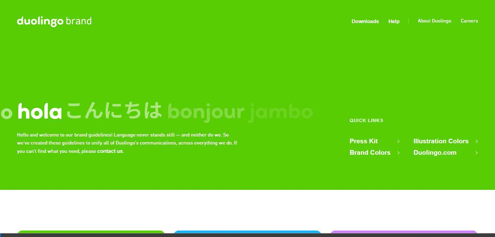

* **What this video demonstrates:**
  * **High Upfront Usability:** Scratch visual blocks remain permanently visible in a left-side drawer for zero-friction creation.
  * **Category Color Chunking:** Smooth visual separation between motion blocks, sound blocks, and control loops.

---

## 🖼️ Curated Reference Gallery & Visual Analysis

### 1. Duolingo – Gamified Tactile 3D Minimal
**Best For:** Kids & Young Teens (High retention, fun interactions).

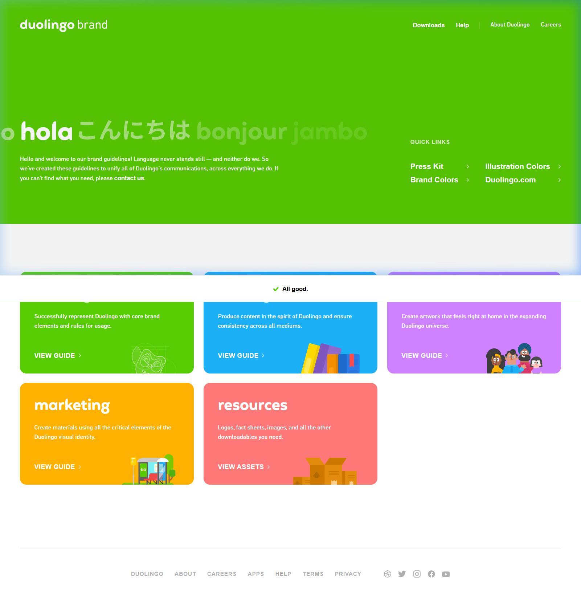
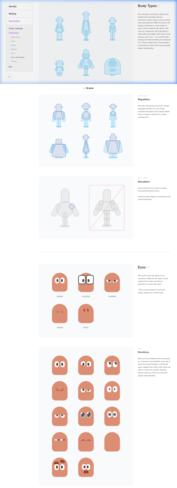

* **Motion & Tactile Feel:** Buttons use a physical 3D inset bottom shadow depth (`box-shadow: 0 5px 0 #58a700`). Clicking pushes the button down into the shadow. This tactile physical feedback makes even simple forms feel like a game widget.

---

### 2. Scratch (MIT) – Upfront Visual Blocks
**Best For:** Low cognitive load & instant creation.

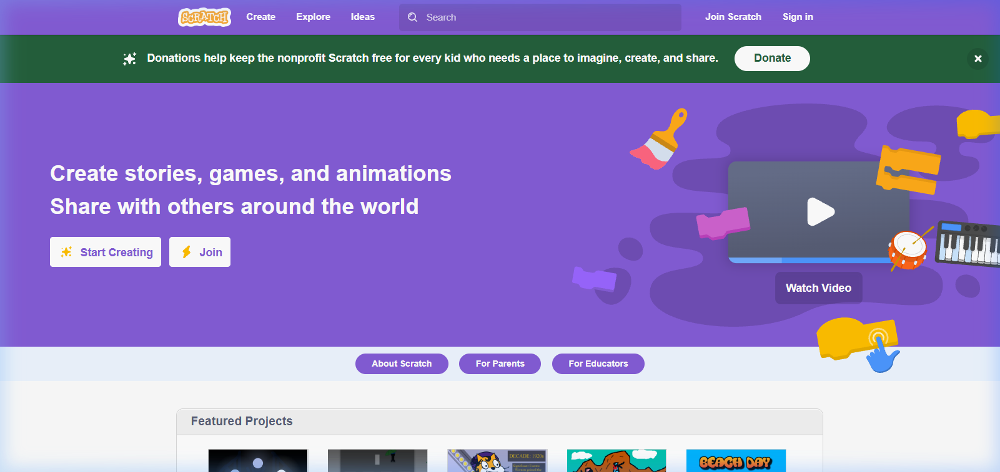
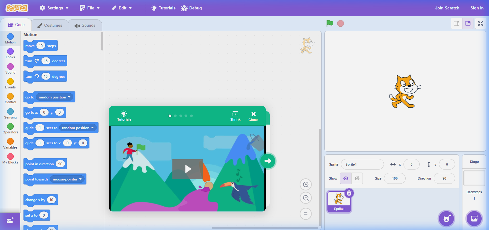

* **Motion & Layout Feel:** Color-coded block categories (Motion = Blue, Control = Yellow, Sound = Pink). Everything is visible upfront without buried drop-down menus or hidden settings.

---

### 3. Greenlight – Family Bento Grid SaaS
**Best For:** Kids + Parents Together (The ideal family SaaS balance).

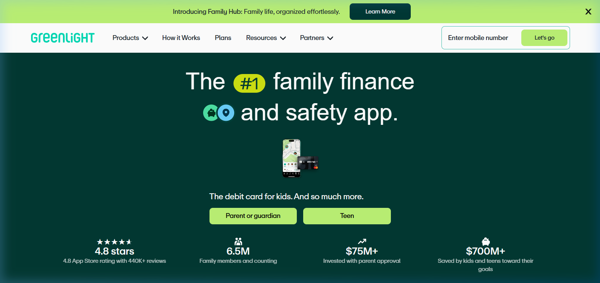
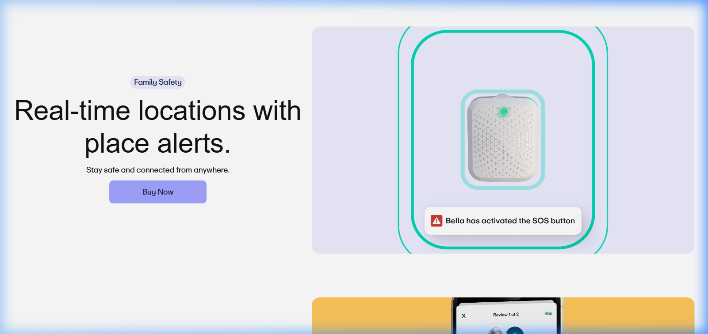

* **Motion & Card Elevation:** **Bento Grid Cards**. Information is chunked into discrete cards with heavy rounded corners (`24px`). Hovering elevates the card with `translateY(-6px)`.

---

### 4. Synthesis – High-Tech Cyber Gaming for Learners
**Best For:** Older Kids & Teens who dislike "babyish" designs.

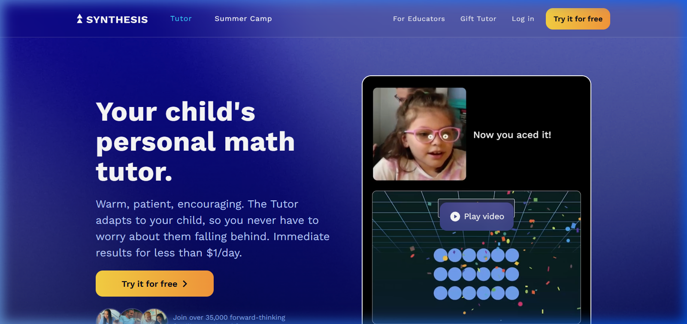
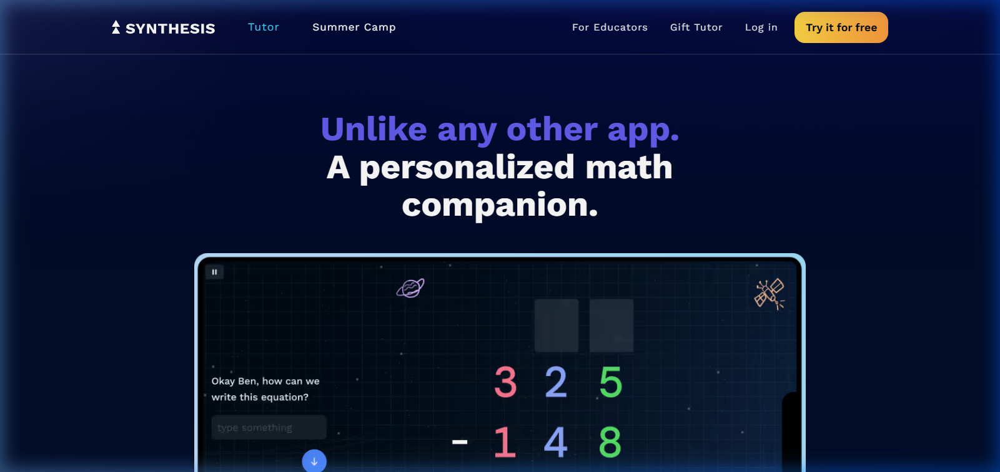

* **Motion & Glow Vibe:** Dark slate backgrounds (`#0F172A`), glowing cyan/purple borders, and radial hover gradients.

---

### 5. Step – Sleek Gen-Z Teen Fintech
**Best For:** Teenagers wanting a "cool" modern look.

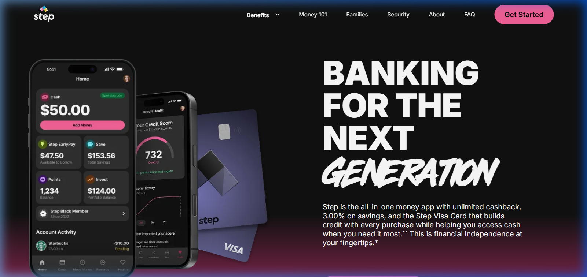

---

### 6. Content Architecture (Style Reference) – Structural Minimal Grid
**Best For:** Clean organizational layout & architectural clarity.

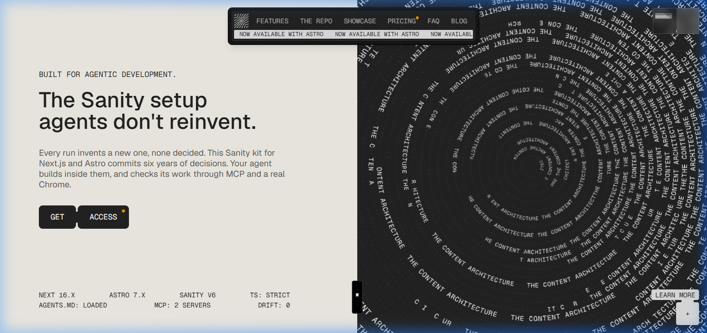

---

### 7. Klarna US (Style Reference) – Fluid Color Blocks & Micro-Interactions
**Best For:** Playful pastel color palettes & bouncy hover physics.

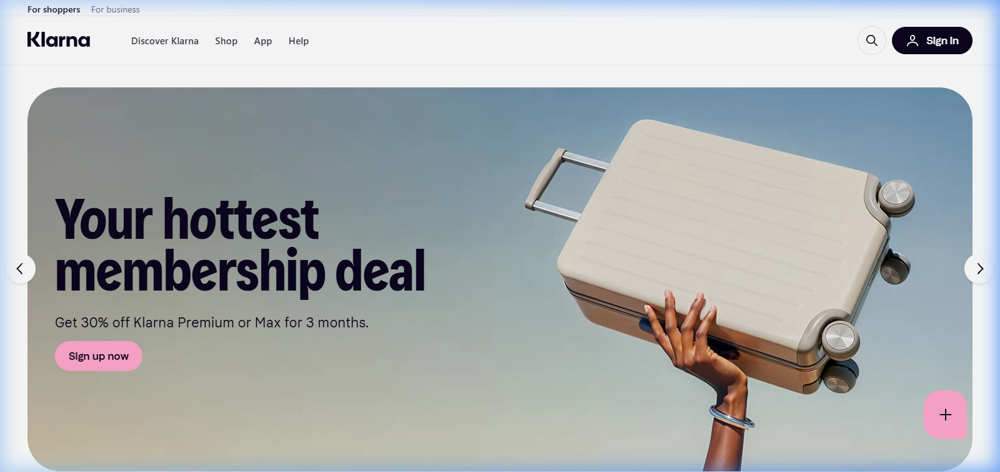
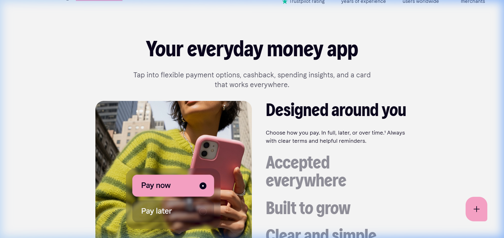

---

## 🛠️ "How I Would Build It": Master Motion & UI Strategy

If I were building a SaaS application designed for **both parents and children/teens**, here is the exact step-by-step motion & UI strategy I would execute:

1. **Spring Motion Curves:** Avoid flat linear CSS transitions. Use `cubic-bezier(0.34, 1.56, 0.64, 1)` for hover states to give buttons and bento cards an energetic, elastic feel.
2. **Tactile Push States:** Apply `box-shadow` depth to primary CTAs so users feel physical feedback when clicking.
3. **Bento Card Chunking:** Use 24px rounded bento grid containers to balance parent readability with kid scannability.
4. **Interactive Demo:** Test all hover & click animations live in [`interactive_demo.html`](./interactive_demo.html).
