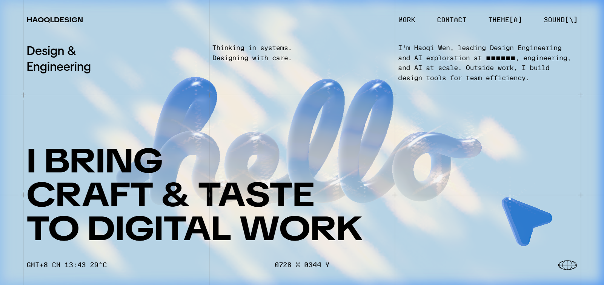
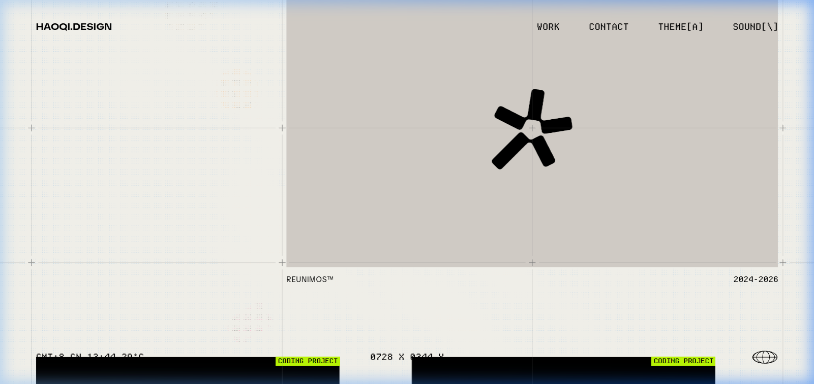
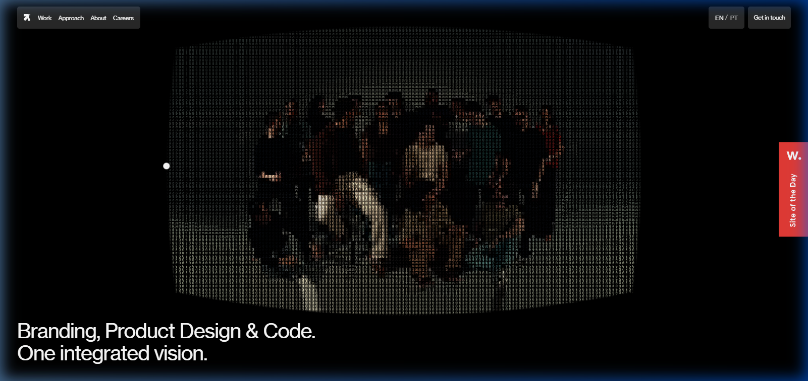
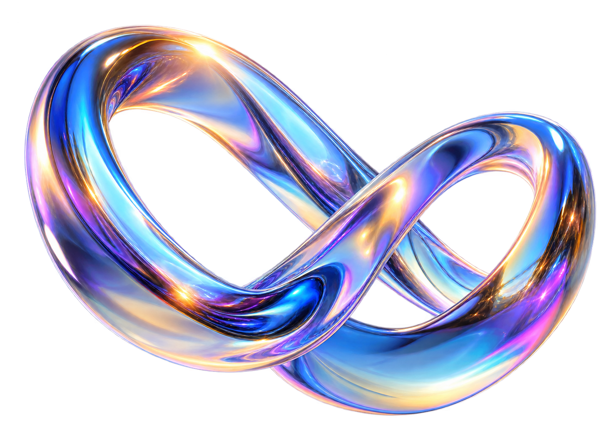

# The creative process

**Read this one first.** The other files describe *what* was built and *how it
was verified*. This one describes how the design was arrived at — the actual
reasoning, in order, including the dead ends.

Everything below happened on one real build (MyMailGram). Nothing is
reconstructed or idealised.

---

## Part 1 — How I found the design

### Step 1: I read the product before I looked at anything visual

Before opening a single reference image, I read the existing product code and
copy. Not to reuse it — most of it was generic template material — but to find
**what the product actually claims about itself.**

The decisive find was a line in the product's own FAQ:

> "MyMailGram is designed for targeted, context-driven personal broadcast
> emails, **not mass blasting or automated DMs.**"

That sentence became the brief. Everything else followed from it.

Then I looked at the category. Instagram-scraping cold-email tools all look the
same: dark UI, neon accents, glowing charts, terminal typography. And I noticed
the contradiction that decided the whole project:

> **If I built the expected dark scraper dashboard, the design would argue
> against the product's own central claim before anyone read a word.**

A visitor arriving at a dark, neon, data-heavy page has already concluded "this
is a scraping tool" — and every sentence of copy after that is fighting uphill.

### Step 2: I inverted the category

So the design question stopped being "what should an email tool look like?" and
became:

> **What does the opposite of a scraper dashboard look like, while still being
> credible software?**

The answer had to be a *material*, not a colour scheme. Colour schemes are
arbitrary and get argued about. Materials carry meaning automatically, because
people already know what they mean.

I ran through material candidates:

| Material | What it says | Verdict |
|---|---|---|
| Dark terminal | technical, powerful, extractive | the cliché — rejected |
| Clinical white/SaaS | neutral, corporate, forgettable | says nothing — rejected |
| Brutalist concrete | bold, raw, confrontational | wrong emotional register for correspondence |
| **Warm stationery / paper** | **personal, written, considered, human** | **chosen** |

Paper won because of one specific property: **a letter is the physical object
this product produces.** Not a dashboard, not a database — a letter. The
material and the output are the same thing.

That is the test for a good material choice: *does the medium already mean what
the product does?* If yes, the design does argumentative work for free.

### Step 3: I gave the world a name

"Studio Correspondence."

This matters more than it sounds. A named world is a decision-making tool. For
every subsequent question — should this button glow? should this section be
dark? should numbers animate? — the question becomes:

> *Does this belong in Studio Correspondence?*

Glowing neon does not. A handwriting face does. A faint blueprint grid does,
because studios use drafting paper. A terminal-green log readout does not, so
when I built the live demo I used warm ochre and ink instead.

**The name is a filter that keeps a hundred small decisions coherent without
re-deriving the reasoning each time.**

---

## Part 2 — How I matched design to brand

### The brand had no visual identity, only claims

There was no logo system, no palette, no type spec. What existed were claims in
the product copy:

- "personal, not mass"
- "public data only"
- "you edit every draft"
- "export and send from your own tool"

**Every one of those is about restraint.** The product's whole pitch is that it
does *less* than competitors: fewer emails, no automation, no sending on your
behalf.

So the design had to feel restrained too. That produced concrete rules:

| Brand claim | Design consequence |
|---|---|
| "personal, not mass" | Warm paper ground, a handwriting face, letter-like composition |
| "public data only" | Nothing hidden — the live demo shows its own working, colour-coded to source |
| "you stay in control" | No autoplaying video, no forced modals, no dark patterns |
| "fewer, better emails" | Generous white space. The page does not shout at you |
| "not a scraper" | Exactly ONE dark section in the entire site, and it is the honest one |

### The one dark section — matching *against* the brand deliberately

The live demo is the only dark surface on the marketing site. That seems to
contradict everything above. It is deliberate, and the reasoning is the most
useful thing in this section:

The demo is the moment the product does the technical thing — searching,
scraping, enriching. That *is* machine work, and pretending otherwise would be
dishonest. So the design admits it: this one section goes dark, because it is
the one moment where the machine register is truthful.

And because everything around it is warm paper, the dark section **lands as an
event** rather than as a default. It is the climax of the page.

> **The rule: use the register your product is accused of exactly once, at the
> moment it is honest, and it stops being an accusation.**

### When the brand and my taste disagreed

The user told me directly: *"there is nothing you have to bias around me...
deliver what you personally feel is the best."*

That is genuine permission, and the right way to use it is not to ignore their
input — it is to stop optimising for their approval and start optimising for the
product's argument. Two concrete cases:

1. They asked for **"bluish with a green accent"** at the very start. I built
   warm cream and ochre instead, because blue-green is the category cliché and
   would have argued against the product. I explained why. They accepted it,
   and later called the result "super cool".

2. They said the earlier build was **"too plain"** and wanted more effects. The
   temptation was to add motion everywhere. Instead I added *colour meaning*
   (the pipeline hue mapping) and *one* new effect class. More effects would
   have broken the restraint the brand depends on.

**Taking creative ownership means being able to say why you did not do what was
asked — and being right about it.**

---

## Part 3 — How I used the reference images

Three references were supplied. Here is the strongest one:



### What I actually did with it

Most agents would copy this: pale blue ground, chrome lettering, black grotesk.
The result would have been a slightly-worse version of someone else's site, in
a palette that fights the product's story.

Instead I made two lists.

**What this reference does BRILLIANTLY (steal the principle):**

| Observation | Principle extracted | How I applied it |
|---|---|---|
| A faint drafting grid with small `+` registration marks | Structure made visible but quiet — it signals precision without decoration | `.grid-field`: 68px grid at ~4.5% opacity, radially masked so it fades at the edges |
| Monospace microtype in the corners (`GMT+8 CN 13:43 29°C`, `0728 X 0344 Y`) | Small technical type used as *texture*, not information. It makes a page feel instrumented | JetBrains Mono for section slugs, stat labels, table headers. Nobody reads them; everybody feels them |
| One chrome object, physically rendered, overlapping the type | A single hero object with real material presence, layered *with* the text rather than beside it | The torus-knot thread, chrome-rendered, overlapping the headline column |
| Enormous black grotesk doing all the shouting | Let one type size carry the entire voice; everything else recedes | Archivo 800/900 at `clamp(2.7rem, 7.2vw, 6.6rem)`, tracking −0.038em |
| Very few type sizes overall | Restraint in the type scale reads as confidence | Three display sizes, one body, one mono. That is the whole system |

**What I deliberately REJECTED:**

| Reference element | Why it had to go |
|---|---|
| Pale blue ground | Cool blue is the tech-category default and fights "warm correspondence" |
| Chrome script lettering ("hello") | Beautiful, but it is *decoration*. My hero object had to be a *metaphor*, not a flourish |
| Photographic sky texture | Too atmospheric — would have diluted the paper material |
| The blue arrow cursor | Kept the *idea* of a custom cursor, rebuilt it as a warm triangular pointer with physics |

### The second reference, and where the lime came from



This one gave me exactly one thing, and it is the most-used accent in the final
site: **the acid-green tag.**

Look at `CODING PROJECT` in that bright chartreuse. On a page that is otherwise
paper, grey and black, that single hot colour does enormous work — it marks
"live / active / now" and nothing else.

I took the *role*, not the exact hue: one high-energy accent, used sparingly,
meaning "right now". That became `--lime: #C8F751`, used for the browser text
selection colour, the "live" pill, and eventually the hover state on every
button in the site. It is the only colour in the system allowed to be loud.

### A reference I rejected entirely — and why that matters



This was also supplied. It is beautiful, technically impressive, and I used
almost nothing from it.

Dark ground, ASCII/dot-matrix rendering of a photograph, thin white type, a
red "Site of the Day" ribbon. Genuinely excellent work — and completely wrong
for this product:

- **The dark ground** is the category cliché I had just spent the analysis
  deciding to avoid.
- **The ASCII rendering** says "data, decoded, machine-processed" — which is
  precisely the accusation the product is defending itself against.
- **The overall register** is agency-showreel: it is designed to impress
  other designers, not to reassure a sceptical studio owner about spam.

I kept exactly one idea from it: **the confidence to let a hero be mostly empty
space with one object in the middle.** That is a compositional principle,
separable from everything else in the image.

**Why this is worth recording:** being given a reference is not an instruction
to use it. Part of the job is recognising when a reference is excellent *and*
wrong for this brief, saying so, and taking only the transferable principle.
An agent that dutifully blends every supplied reference produces mush.

The test is always the same: *does this move the product's argument forward?*
Beauty alone is not a reason.

### The resolution procedure, generalised

When a reference conflicts with the brand — which happened here on the ground
colour — run this:

1. **Name what the reference does well.** Here: a pale, even ground with faint
   structure produced a feeling of calm authority.
2. **Ask what actually caused that effect.** It was *evenness and low internal
   contrast*, not *blueness*. The ground being uniform is what made the black
   type land so hard.
3. **Reproduce the cause with brand-correct material.** Warm cream `#F7F4ED`,
   same evenness, same faint grid, same enormous black type. The authority
   survived intact; only the hue changed.

> **Nine times in ten, what you admire in a reference is a structural property
> that is fully separable from its colour. Separate it.**

---

## Part 4 — How I brought the references to life

Extracting principles is analysis. Turning them into an object is the creative
step. Here is the actual chain of thought for the hero.

### Choosing the object

The reference had chrome script lettering. I needed a chrome *something*. But
what?

I refused to take the first idea and instead ranked candidates against the
product's claim:

| Candidate | Reasoning | Verdict |
|---|---|---|
| Globe / network mesh | The literal scraper-dashboard cliché | **Rejected** — argues against the product |
| Envelope | Says "email" but not "personal". Too literal; a logo, not a metaphor | **Rejected** |
| Funnel | Implies volume and filtering — the exact thing the FAQ denies | **Rejected**, and dangerously so |
| Paper plane | Says "send", but it is the most overused object in the category | **Rejected** |
| **Torus knot (trefoil)** | A single continuous line that weaves through itself and emerges as one strand | **Chosen** |

The knot won on three grounds at once:

1. **Semantic** — correspondence *is* a thread. "A thread of emails" is already
   the language people use.
2. **Literal** — it is one unbroken line. Handwritten, not industrial. The
   product's claim is "one personal message", and this is one continuous curve.
3. **Material** — a knot has many surfaces at many angles, so a chrome render
   catches light from everywhere. Which set up the next decision.

### Making the object argue the palette

This is the part I am most pleased with, and it is repeatable.

The palette is warm-versus-cool: ochre = the Instagram side, marine = the
MyMailGram side. I needed the hero object to embody that rather than just sit
near it.

So the chrome environment map was hand-painted on a canvas: **a cool blue sky
above, warm cream paper below, a warm sun upper-left, a cool counter-light
right.** The knot therefore reflects warm on one side and cool on the other.

> The hero object is literally made of the same warm/cool dialogue that the
> colour system uses to mean "them" and "you".

Nobody consciously notices. Everybody feels that the object belongs.

**Generalised rule: do not place your object *on* the palette. Build the object
*out of* the palette.**

### The result



Note what carried over from the reference and what did not: same *role* (one
chrome object, overlapping the type, physically lit), completely different
*subject* and *palette*.

### Bringing the icon set to life

Same procedure at smaller scale. The four pipeline steps needed illustrations.

The failure mode would have been four generic flat icons. Instead I worked
backwards from the world: Studio Correspondence is *tactile and physical*, so
the icons had to be **clay-rendered objects, not line drawings** — things you
could pick up.

And each was assigned the hue its pipeline stage already owned:


| Stage | Object | Hue | Why that object |
|---|---|---|---|
| Discovery | Magnifier over profile tiles | Ochre | Searching the social side |
| Caption intelligence | Document with highlighted lines | Marine | Reading and extracting |
| Composition | Envelope with letter and quill | Plum | The AI writes — and the quill keeps it *handwritten*, not robotic |
| Export | Stack of sheets with an arrow | Sage | Delivered, verified, done |

The quill in the third icon is the whole thesis in one detail. The obvious
choice for "AI writes your email" is a robot or a spark. A **quill pen** says
the same function with the opposite connotation — and the opposite connotation
is the product's entire claim.

> **When illustrating an AI feature, choose the pre-industrial object. It
> performs the same function and carries none of the category's baggage.**

---

## Part 5 — How I would research references from scratch

If none were supplied, here is the exact procedure.

### 1. Establish the negative brief first

Before looking for anything you like, search your product's own category and
catalogue what everything looks like. Write it down.

For this product that list was: dark UI, neon green/cyan accents, glowing line
charts, terminal type, node-graph illustrations, "automation" iconography.

**That list is not inspiration. It is the exclusion list.** Anything on it is
now forbidden unless you have a specific reason.

Most designers skip this and then unconsciously reproduce the category average.

### 2. Search the adjacent physical craft, never the software category

This is the single highest-leverage move in reference research.

Searching "SaaS landing page" returns the cliché you just excluded. Instead ask:
**what physical craft does this product's output belong to?**

| If the product is... | Search the craft of... |
|---|---|
| Email / writing | Letterpress, stationery, editorial print, archival correspondence |
| Analytics | Scientific instruments, cartography, wayfinding, technical drawing |
| Security | Bank engraving, seals, vaults, locksmithing, guilloché |
| Scheduling | Railway timetables, almanacs, drafting tables |
| Audio | Studio hardware, VU meters, tape, mixing desks |

The vocabulary you find there does not exist in your competitors' work, because
none of them looked there.

### 3. Collect for structure, then throw the images away

For each candidate, answer in writing:

- How many distinct type sizes? (Good design usually uses fewer than you expect)
- What is the ratio of empty space to content?
- Where does the eye land first, and what forced it there?
- Is there one hero object? What is its relationship to the type — beside it, or
  overlapping it?
- What is the smallest text on the page, and is it doing information work or
  texture work?
- How many colours, and does each one *mean* something?

**Then discard the images and keep only the answers.** If you keep the images
open while designing, you will copy surfaces. If you keep only the structural
notes, you will apply principles.

### 4. Find one anchor artefact

Reduce everything to a single physical object, texture or process the entire
world can hang from. Here it was **warm uncoated stationery**.

An anchor gives you an instant answer to unforeseen questions. When I later
needed a dark mode for the app, the anchor answered it: *not* neutral zinc like
every other dashboard, but **warm near-black — the same paper seen in low
light**. That is why the dark palette is called Ember and carries a ~30° hue
shift rather than sitting on pure grey.

### 5. Test the assembled world against the product claim

Final gate. State it as one sentence:

> "This world argues that the product is ______, which is exactly what a
> sceptical visitor doubts."

If you cannot complete that sentence, you have assembled a mood board, not a
design direction. Start over.

---

## Part 6 — How the creative reasoning actually worked

Four habits did most of the work.

### Habit 1: Rank and reject in writing

Never take the first idea. For every significant choice — hero object, material,
dark palette, icon subjects — I listed at least four options and wrote why three
lost.

The first idea is almost always the category average, because it is the most
available. **Writing down the rejections is what makes the reasoning survive
later pressure**, when someone asks "why isn't this blue?"

### Habit 2: Make every decision inherit from one parent decision

One decision was load-bearing: *the design must argue "personal, not mass".*

Every later choice was derived from it rather than made fresh:

```
"personal, not mass"
├── warm paper ground, not dark UI
│   ├── ochre/marine warm-cool mapping
│   │   └── chrome env-map painted warm-above-cool
│   └── dark mode for the app = warm Ember, not neutral zinc
├── one handwriting face, used sparingly
│   └── onboarding annotations are handwritten with drawn arrows
├── restraint in motion
│   └── no linear easing, no autoplay, one effect at a time
└── exactly one dark section, at the honest moment
    └── live demo colour-codes borrowed phrases back to their source
```

This is why the site feels coherent. It is not that many good decisions were
made; it is that **one decision was made and then inherited**.

### Habit 3: Ask "what does this mean?" before "what does this look like?"

Every visual element got a semantic job:

- Colour → which pipeline stage
- The dark section → the honest machine moment
- The handwriting face → the human voice, used twice
- Lime → live, right now
- Icon material (clay) → tactile, physical, made by hand

When something has no semantic job, it is decoration, and decoration is the
first thing to cut.

### Habit 4: Let the product's weaknesses into the design

The strongest single moment in the build is on the pricing page. The overage
calculator will tell you, out loud, when a **competitor is cheaper** at your
volume, and when a **different tier of ours** would cost you less.

That was not in any brief. It came from the world: Studio Correspondence is
honest, so the pricing page had to be honest, so it had to say the unflattering
thing where it was true.

Similarly, roadmap features are visually quieter, dashed, and tagged "Planned" —
because letting a feature list imply something unshippable would break the same
principle.

> **A named world does not just tell you what things look like. It tells you how
> to behave.**

---

## The shortest version

1. Read the product until you find the sentence it is trying to prove.
2. Look at the category and find what you must *not* look like.
3. Pick a **material**, not a palette — one whose meaning already matches the
   product's output.
4. Name the world. Use the name to filter every later decision.
5. From references, take **structure**; leave **surface**.
6. Rank at least four options for anything important, and write the rejections.
7. Build the hero object *out of* the palette, not on top of it.
8. Give every visual element a semantic job, and cut what has none.
9. Let the world dictate behaviour, not just appearance.
10. Then measure everything, because taste does not catch a contrast failure.
